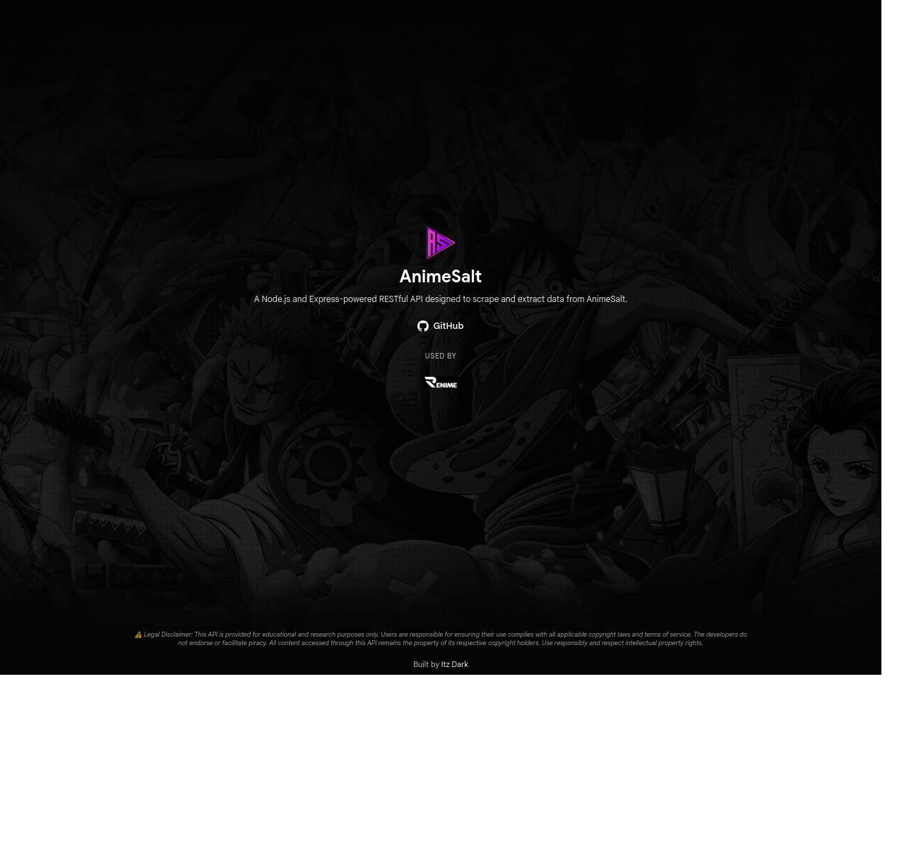

# AnimeSalt Scraper API


A Node.js and Express-powered RESTful API designed to scrape and extract data from AnimeSalt.

## Screenshot



## ⚠️ Legal Disclaimer

**This API is provided for educational and research purposes only.** Users are responsible for ensuring their use complies with all applicable copyright laws and terms of service. The developers do not endorse or facilitate piracy. All content accessed through this API remains the property of its respective copyright holders. Use responsibly and respect intellectual property rights.

## Features

- 🎬 Extract home page content (newest drops, trending, etc.)
- 📺 Get detailed information about series and movies
- 📚 Fetch episodes by season
- 🎥 Extract embed player links
- 🔍 Browse by category (movies, series, anime, cartoon, genres, languages)
- 🔤 Browse alphabetically by letter (A-Z)
- 🔎 Search functionality (AJAX suggestions and full page search)
- 🔒 Origin-based access control
- 🛡️ Security middleware (Helmet, CORS, Rate Limiting)
- 📄 Beautiful HTML error pages (403, 404)

## Prerequisites

- Node.js >= 18.0.0
- npm or yarn

## Installation

1. Clone the repository:
```bash
git clone https://github.com/itzzzdark/AnimeSalt-API.git
cd AnimeSalt-API
```

2. Install dependencies:
```bash
npm install
```

3. Create a `.env` file from the example:
```bash
cp .env.example .env
```

4. Configure your environment variables (see [Configuration](#configuration))

5. Start the server:
```bash
# Development mode (with auto-restart)
npm run dev

# Production mode
npm start
```

## Configuration

Create a `.env` file in the root directory with the following variables:

```env
PORT=3000
NODE_ENV=development
CORS_ORIGIN=https://example.com,https://another.com
```

### Environment Variables

- `PORT` - Server port (default: `3000`)
- `NODE_ENV` - Environment mode: `development` or `production` (default: `development`)
- `CORS_ORIGIN` - Allowed origins for API access:
  - Set to `*` to allow all origins
  - Or specify comma-separated list: `https://example.com,https://another.com`
  - Requests without matching origin/referer will be blocked with 403

## API Endpoints

All endpoints are prefixed with `/api` and require a valid origin/referer header (unless `CORS_ORIGIN=*`).

### Home Page

Get home page content including newest drops, trending, and other categories.

```http
GET /api/home
```

**Response:**
```json
{
  "newestDrops": [...],
  "trending": [...],
  "animeMovies": [...],
  ...
}
```

### Category/Type Listing

Browse content by category or type with pagination.

```http
GET /api/category/{type}?page={page}
```

**Parameters:**
- `type` - Category type (e.g., `movies`, `series`, `anime`, `cartoon`, `genre/sci-fi`, `language/hindi`)
- `page` - Page number (optional, default: `1`)

**Example:**
```http
GET /api/category/movies?page=1
GET /api/category/genre/sci-fi?page=2
GET /api/category/language/hindi?page=1
```

**Response:**
```json
{
  "success": true,
  "currentPage": 1,
  "totalPages": 8,
  "data": {
    "items": [...]
  }
}
```

### Letter/Alphabetical Browsing

Browse content alphabetically by letter with pagination.

```http
GET /api/letter/{letter}?page={page}
```

**Parameters:**
- `letter` - Letter to browse (e.g., `A`, `B`, `D`, `Z`)
- `page` - Page number (optional, default: `1`)

**Example:**
```http
GET /api/letter/D?page=1
GET /api/letter/A?page=2
```

**Response:**
```json
{
  "success": true,
  "currentPage": 1,
  "totalPages": 3,
  "data": {
    "items": [...]
  }
}
```

### Search

Search for content using AJAX suggestions or full page search.

```http
GET /api/search?suggestion={term}
GET /api/search?q={term}
```

**Query Parameters:**
- `suggestion` - Search term for AJAX quick suggestions (returns minimal data without images)
- `q` - Search term for full page search (returns complete results with images)

**Note:** Either `suggestion` or `q` parameter is required.

**Example:**
```http
GET /api/search?suggestion=naruto
GET /api/search?q=naruto
```

**Response (AJAX suggestion):**
```json
{
  "success": true,
  "data": {
    "items": [
      {
        "id": "naruto",
        "type": "series",
        "title": "Naruto"
      }
    ]
  }
}
```

**Response (Full page search):**
```json
{
  "success": true,
  "data": {
    "items": [
      {
        "id": "naruto",
        "type": "series",
        "title": "Naruto",
        "image": "https://image.tmdb.org/t/p/w500/..."
      }
    ]
  }
}
```

### Series/Movie Details

Get detailed information about a specific series or movie.

```http
GET /api/info/{id}
```

**Parameters:**
- `id` - Series or movie ID (e.g., `spy-x-family`, `your-name`)

**Response:**
```json
{
  "id": "spy-x-family",
  "type": "series",
  "postId": "1101",
  "title": "Spy x Family",
  "image": "...",
  "background": "https://image.tmdb.org/t/p/w1280/...",
  "description": "...",
  "genres": [...],
  "languages": [...],
  "duration": "...",
  "year": "...",
  "seasons": [1, 2, 3],
  "episodes": "43",
  "episodesList": [...],
  "recommended": [...]
}
```

**Note:** For movies, `seasons`, `episodes`, and `episodesList` fields are excluded.

### Episodes by Season

Get episodes for a specific season of a series.

```http
GET /api/episodes/{id}/{season}
```

**Parameters:**
- `id` - Series ID
- `season` - Season number

**Response:**
```json
{
  "success": true,
  "id": "spy-x-family",
  "postId": "1101",
  "season": 2,
  "episodes": [...]
}
```

### Embed Player Links

Get embed player links for an episode.

```http
GET /api/embed/{id}
```

**Parameters:**
- `id` - Episode ID (e.g., `spy-x-family-3x1`)

**Response:**
```json
{
  "id": "spy-x-family-3x1",
  "servers": [
    {
      "server": 0,
      "name": "Play",
      "url": "..."
    },
    {
      "server": 1,
      "name": "Abyss",
      "url": "..."
    }
  ]
}
```

**Note:** If the episode page returns 404, the API will fall back to the series/movie details page to find iframes.

### Health Check

Check API health status.

```http
GET /api/health
```

**Response:**
```json
{
  "success": true,
  "data": {
    "status": "healthy",
    "timestamp": "...",
    "uptime": 123.45
  }
}
```

### Generic Scraper

Scrape any URL with optional extractor.

```http
GET /api/scrape?url={url}&extractor={extractor}
```

**Query Parameters:**
- `url` - URL to scrape (required)
- `extractor` - Extractor type (optional)

## Security Features

### Origin Blocking

The API implements origin-based access control:

- Requests to `/api/*` endpoints require a valid `Origin` or `Referer` header
- Origins must match the `CORS_ORIGIN` environment variable
- Requests without origin/referer or with non-allowed origins receive a 403 Forbidden response
- Set `CORS_ORIGIN=*` to allow all origins (not recommended for production)

### Rate Limiting

- 100 requests per 15 minutes per IP address
- Applied to all `/api/*` endpoints

### Security Headers

- Helmet.js for security headers
- CORS configuration
- Compression middleware

## Error Handling

- **403 Forbidden** - Origin/referer not allowed (serves `403.html`)
- **404 Not Found** - Route not found (serves `404.html`)
- **400 Bad Request** - Invalid request parameters
- **429 Too Many Requests** - Rate limit exceeded
- **500 Internal Server Error** - Server error

## Project Structure

```
AniBiee-AnimeWorldIndia-scraper/
├── public/              # Static files (HTML pages, images)
│   ├── index.html      # Home page
│   ├── 404.html        # 404 error page
│   └── 403.html        # 403 error page
├── src/
│   ├── base/           # Base classes for scraping
│   ├── config/         # Configuration files
│   ├── controllers/    # Route controllers
│   ├── extractors/     # Data extraction logic
│   ├── middleware/     # Express middleware
│   ├── routes/         # API routes
│   ├── utils/          # Utility functions
│   └── router.js       # Router setup
├── server.js           # Entry point
├── package.json        # Dependencies
└── .env.example        # Environment variables example
```

## Development

```bash
# Run in development mode with auto-restart
npm run dev

# Run linter
npm run lint
```

## License

ISC License - See [LICENSE](LICENSE) file for details.

## Author

**Basirul Akhlak Borno**

- Website: https://github.com/basirulakhlakborno
- GitHub: https://github.com/basirulakhlakborno

## Copyright

Copyright (c) 2025 Basirul Akhlak Borno. All Rights Reserved.

## Disclaimer

⚠️ **LEGAL DISCLAIMER:** This API is provided for educational and research purposes only. Users are responsible for ensuring their use complies with all applicable copyright laws and terms of service. The developers do not endorse or facilitate piracy. All content accessed through this API remains the property of its respective copyright holders. Use responsibly and respect intellectual property rights.
